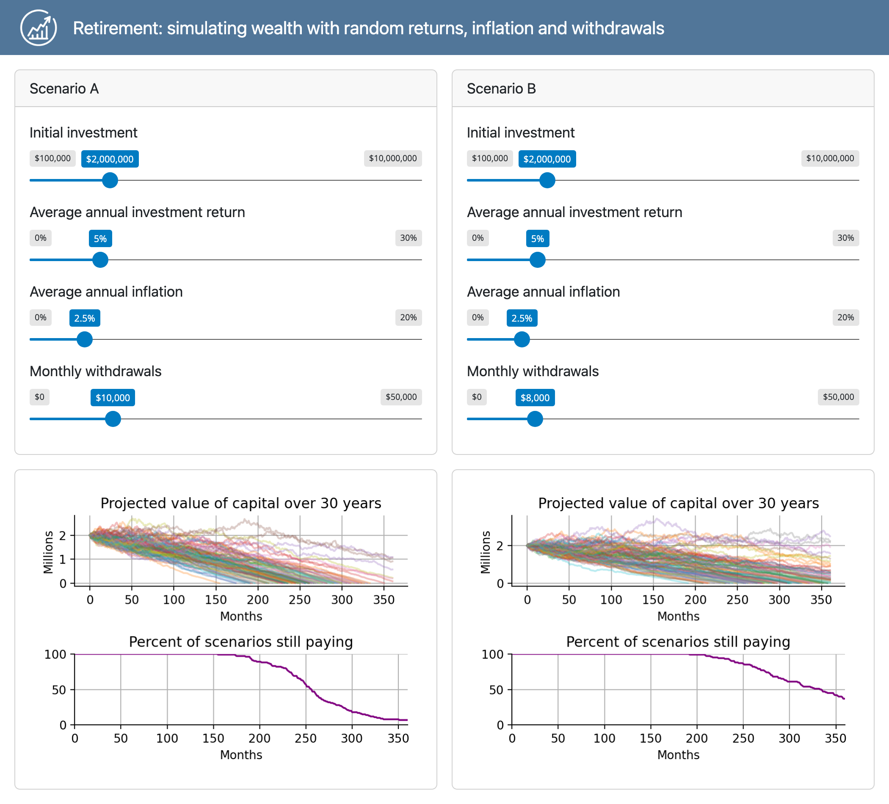

Retirement simulation dashboard
===============================

This is a retirement savings simulation dashboard, built with [Quarto](https://quarto.org/) and [Shiny](https://shiny.posit.co/py/) for Python. Quarto provides the document structure and layout, and Shiny provides the interactivity.

[](https://wch.github.io/retirement-simulation-dashboard/)

[Live dashboard](https://wch.github.io/retirement-simulation-dashboard/).

[Learn more](https://quarto.org/docs/dashboards/interactivity/shiny-python/index.html) about using Quarto and Shiny to create interactive dashboards


## Deployment to a static web host

This Quarto dashboard uses Shiny for interactivity and is deployed as a static web page to GitHub Pages.

A static Quarto dashboard can be deployed to a static web host, such as GitHub Pages, because it requires no computation on the server. A Quarto dashboard that uses Shiny for interactivity requires Python running on the server, because
 normally must be deployed on a platform with servers running Python, such as [shinyapps.io](https://www.shinyapps.io/) (Posit's hosted platform) or [RStudio Connect](https://rstudio.com/products/connect/) (Posit's on-premises server platform).

However, Quarto dashboard with Shiny can also be deployed to a static web host (with some limitations discussed below). This is done by using [Shinylive](https://shiny.posit.co/py/docs/shinylive.html), which is a special deployment mode of Shiny where, instead of running Python on a remote server, Python itself runs in the web browser. This means that the dashboard can be deployed as a static web page to any static web host, such as GitHub Pages.

Some limitations of Shinylive:

- Not all Python packages can run in the web browser.
- No secrets: all data and code is sent to the web browser, so it is not appropriate if your code or data contains any information that you want to keep private.

See the [Shinylive documentation](https://shiny.posit.co/py/docs/shinylive.html) for more details.

To deploy this dashboard to a static web host, first make sure [Quarto](https://quarto.org/docs/download/) (version 1.4.475 or higher) is installed. Then install the shinylive Python package:

```bash
pip install shinylive --upgrade
```

As you work on your Quarto-Shiny dashboard, make sure
When you have finished working on your Quarto dashboard, run the following:

```bash
quarto render --output-dir _build
```

This will generate the following files in `_build/`:

- `retirement.html` - the static HTML file for the dashboard
- `retirement_files/` - a directory containing JS and CSS files for the dashboard
- `app.py` - a Python file with the Shiny code

These files collectively constitute a Shiny application. You can run and deploy this as a normal Shiny application, but at this point we will convert it to a static web page using Shinylive:

```bash
shinylive export _build _site
```

This will generate a Shinylive bundle. You can view the app locally by running:

```bash
python3 -m http.server --directory _site --bind localhost 8008
```

Then visit http://localhost:8008/ in a web browser. If that looks good, you can deploy the `_site/` directory to your static web host.


### Automatically deploying to GitHub Pages with GitHub Actions

With GitHub Actions, you can deploy your dashboard every time you push to a repository. This repository has a GitHub Actions workflow that does this. If you would like to use it:

- Ensure that you have a `requirements.txt` that is up to date with your Python dependencies. You can generate this file by running:
    ```bash
    pip freeze > requirements.txt
    ```
- In the **Settings** tab of your repository, select **Pages** in the sidebar, and then under **Build and deployment** set the **Source** to **GitHub Actions**.
- Copy the file [`.github/workflows/build-deploy.yml`](.github/workflows/build-deploy.yml) to the same location in your repository, then commit it and push.

It will then start building and deploying your dashboard. You can view the progress in the **Actions** tab of your repository.

If the page successfully deploys, you can view it at `https://<username>.github.io/<repo-name>/`. For example, the dashboard in this repository is deployed at https://wch.github.io/retirement-simulation-dashboard/.

